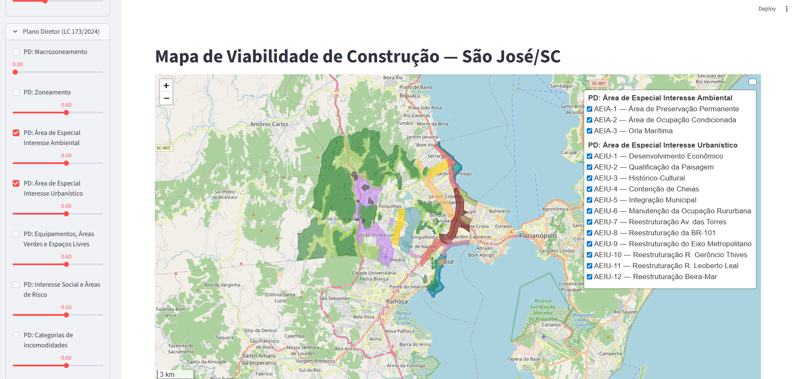

# Construction Viability Map

> Interactive web map that helps visualize construction viability across a municipality through independent, toggleable overlay layers — terrain slope, environmental constraints, and Master Plan zoning.




*Example: Master Plan special-interest zones (LC 173/2024) of São José/SC, served as interactive vector overlays over the OpenStreetMap basemap.*

## Objective

The goal is an interactive map that communicates construction viability across a city, not as a precomputed verdict per lot, but as a set of independent layers the user explores and toggles directly:

- **Physical characteristics**: terrain slope, permanent preservation areas (APP), natural-disaster risk areas
- **Legal characteristics**: zoning and special-interest areas from the municipal Master Plan
- **Urban context**: roads, hydrography and buildings from OpenStreetMap

The architecture is **modular per municipality**: new cities can be added without touching the core code.

## Deliverables

- A geospatial pipeline: **ingest** (IBGE, OSM, Topodata) → **transform** (slope raster, APP buffers, automated Master Plan vectorization) → **publish** as interactive layers.
- Master Plan PDF annexes turned into **vector polygon layers** (GeoParquet) via HSV color segmentation — no manual digitizing.
- A **Streamlit + Folium** app with a permanent OSM basemap, per-layer opacity, and per-zone toggles.
- A reusable **Adapter Pattern** so a second municipality plugs in without refactoring the core.

### Pilot city

**São José, Santa Catarina, Brazil** (IBGE code: 4216602)

Next planned city: Florianópolis/SC.

## Stack

- **Python 3.11+**
- **GeoPandas / Rasterio / OSMnx** — geospatial data pipeline
- **Streamlit + Folium** — interactive web UI
- **GeoParquet** — final tabular dataset

## Quickstart

```bash
# 1. Clone the repository
git clone https://github.com/VTheStone/construction-viability-map.git
cd construction-viability-map

# 2. Create and activate a virtual environment
python -m venv venv
# Linux / macOS:
source venv/bin/activate
# Windows PowerShell:
venv\Scripts\Activate.ps1

# 3. Install dependencies
pip install -r requirements.txt

# 4. Run the data pipeline (once)
make process REGION=sao_jose_sc

# 5. Launch the app
make app
```

## Project structure

```

construction-viability-map/
├── config/regions/             # 1 YAML per municipality
├── src/
│   ├── core/                   # code shared across cities
│   └── regions/                # city-specific adapter
├── data/                       # gitignored (generated by pipeline)
└── tests/

```

Full details in [`PROJECT_PLAN.md`](./PROJECT_PLAN.md).

## Adding a new city

1. Create `config/regions/my_city.yaml` (use `_template.yaml` as a starting point)
2. Create `src/regions/my_city/adapter.py` implementing the `RegionAdapter` interface
3. Run `make process REGION=my_city`

See [`CONTRIBUTING.md`](./CONTRIBUTING.md) (coming soon).

## Known limitations

- **Lots**: São José/SC has no public cadastral dataset. This project uses OpenStreetMap building footprints + synthetic blocks as a proxy. **It is not a substitute for official municipal records.**
- **Zoning**: Master Plan maps are automatically vectorized via HSV color segmentation of the official PDF annexes (LC 173/2024). Subzones that share a single legend color are merged into one polygon; per-subzone disambiguation via OCR labels is on the roadmap.
- **DEM**: uses Topodata from INPE (~30 m resolution), adequate for municipal-level analysis but coarse for intra-block analysis.

## License

MIT — see [`LICENSE`](./LICENSE).

## Further documentation

- [`PROJECT_PLAN.md`](./PROJECT_PLAN.md) — full project plan, architecture and roadmap